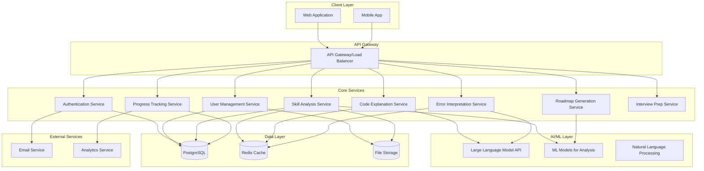

# Design Document: DevMentor AI Platform

## Overview

DevMentor AI is a comprehensive learning platform that leverages artificial intelligence to provide personalized programming education for college students and beginner-to-intermediate developers. The system combines skill analysis, code explanation, error interpretation, personalized learning paths, progress tracking, and interview preparation into a unified platform.

The platform follows a microservices architecture with AI-powered components that adapt to individual learning patterns and provide contextual, educational feedback. The system emphasizes learning from mistakes rather than just fixing them, creating a supportive environment for skill development.

## Architecture

### High-Level Architecture



### Service Architecture Pattern

The system follows a microservices architecture with the following principles:
- **Service Independence**: Each service can be developed, deployed, and scaled independently
- **API-First Design**: All services communicate through well-defined REST APIs
- **Event-Driven Communication**: Services use message queues for asynchronous operations
- **Stateless Services**: Services maintain no session state, enabling horizontal scaling
- **Circuit Breaker Pattern**: Fault tolerance through service isolation

## Components and Interfaces

### 1. Authentication Service
**Responsibility**: User authentication, authorization, and session management

**Key Interfaces**:
```typescript
interface AuthService {
  register(userData: UserRegistration): Promise<AuthResult>
  login(credentials: LoginCredentials): Promise<AuthResult>
  refreshToken(token: string): Promise<AuthResult>
  logout(userId: string): Promise<void>
  validateToken(token: string): Promise<TokenValidation>
}

interface UserRegistration {
  email: string
  password: string
  firstName: string
  lastName: string
  skillLevel: 'beginner' | 'intermediate' | 'advanced'
  goals: string[]
}
```

### 2. Skill Analysis Service
**Responsibility**: Analyze code submissions, identify patterns, and assess skill levels

**Key Interfaces**:
```typescript
interface SkillAnalysisService {
  analyzeCode(submission: CodeSubmission): Promise<AnalysisResult>
  identifyPatterns(userId: string): Promise<ErrorPattern[]>
  generateSkillReport(userId: string): Promise<SkillReport>
  updateSkillLevel(userId: string, newData: AnalysisResult): Promise<void>
}

interface CodeSubmission {
  userId: string
  code: string
  language: string
  context?: string
  timestamp: Date
}

interface AnalysisResult {
  qualityScore: number
  styleScore: number
  complexityMetrics: ComplexityMetrics
  detectedIssues: Issue[]
  suggestions: Suggestion[]
  skillLevelAssessment: SkillLevel
}
```

### 3. Code Explanation Service
**Responsibility**: Provide line-by-line code explanations adapted to user skill level

**Key Interfaces**:
```typescript
interface CodeExplanationService {
  explainCode(request: ExplanationRequest): Promise<CodeExplanation>
  explainConcepts(concepts: string[], skillLevel: SkillLevel): Promise<ConceptExplanation[]>
  generateAnalogies(concept: string, userContext: UserContext): Promise<Analogy[]>
}

interface ExplanationRequest {
  code: string
  language: string
  userId: string
  focusAreas?: string[]
}

interface CodeExplanation {
  lineByLineExplanation: LineExplanation[]
  overallSummary: string
  keyConceptsIdentified: Concept[]
  suggestedResources: Resource[]
}
```

### 4. Error Interpretation Service
**Responsibility**: Convert runtime errors into educational explanations

**Key Interfaces**:
```typescript
interface ErrorInterpretationService {
  interpretError(errorData: ErrorData): Promise<ErrorExplanation>
  suggestFixes(errorData: ErrorData): Promise<FixSuggestion[]>
  trackErrorPatterns(userId: string, errorData: ErrorData): Promise<void>
  generatePreventionTips(errorType: string): Promise<PreventionTip[]>
}

interface ErrorData {
  errorMessage: string
  stackTrace: string
  code: string
  language: string
  userId: string
  context: ExecutionContext
}

interface ErrorExplanation {
  plainLanguageExplanation: string
  whyItHappened: string
  howToFix: string
  preventionStrategies: string[]
  relatedConcepts: string[]
  learningResources: Resource[]
}
```

### 5. Roadmap Generation Service
**Responsibility**: Create and adapt personalized learning paths

**Key Interfaces**:
```typescript
interface RoadmapService {
  generateRoadmap(userId: string, goals: LearningGoal[]): Promise<LearningRoadmap>
  updateRoadmap(userId: string, progressData: ProgressData): Promise<LearningRoadmap>
  suggestNextSteps(userId: string): Promise<NextStep[]>
  adaptToPerformance(userId: string, performanceData: PerformanceData): Promise<void>
}

interface LearningRoadmap {
  milestones: Milestone[]
  estimatedTimeframe: TimeEstimate
  prerequisites: Prerequisite[]
  resources: Resource[]
  assessmentPoints: AssessmentPoint[]
}
```

### 6. Progress Tracking Service
**Responsibility**: Monitor learning progress and generate analytics

**Key Interfaces**:
```typescript
interface ProgressTrackingService {
  recordActivity(userId: string, activity: LearningActivity): Promise<void>
  generateProgressReport(userId: string, timeframe: TimeFrame): Promise<ProgressReport>
  calculateMetrics(userId: string): Promise<ProductivityMetrics>
  identifyAchievements(userId: string): Promise<Achievement[]>
}

interface ProgressReport {
  skillImprovement: SkillImprovement[]
  completionRates: CompletionRate[]
  timeSpentLearning: TimeMetrics
  streaks: LearningStreak[]
  recommendations: Recommendation[]
}
```

## Data Models

### Core Entities

```typescript
// User Entity
interface User {
  id: string
  email: string
  firstName: string
  lastName: string
  skillLevel: SkillLevel
  goals: string[]
  preferences: UserPreferences
  createdAt: Date
  updatedAt: Date
}

// Code Submission Entity
interface CodeSubmission {
  id: string
  userId: string
  code: string
  language: string
  submissionType: 'practice' | 'assessment' | 'project'
  analysisResults: AnalysisResult[]
  timestamp: Date
}

// Learning Session Entity
interface LearningSession {
  id: string
  userId: string
  startTime: Date
  endTime?: Date
  activities: LearningActivity[]
  focusAreas: string[]
  achievements: Achievement[]
}

// Error Record Entity
interface ErrorRecord {
  id: string
  userId: string
  errorType: string
  errorMessage: string
  code: string
  language: string
  resolution: string
  learningOutcome: string
  timestamp: Date
}

// Roadmap Entity
interface LearningRoadmap {
  id: string
  userId: string
  goals: LearningGoal[]
  milestones: Milestone[]
  currentProgress: number
  estimatedCompletion: Date
  lastUpdated: Date
}
```

### Database Schema Design

```sql
-- Users table
CREATE TABLE users (
    id UUID PRIMARY KEY DEFAULT gen_random_uuid(),
    email VARCHAR(255) UNIQUE NOT NULL,
    password_hash VARCHAR(255) NOT NULL,
    first_name VARCHAR(100) NOT NULL,
    last_name VARCHAR(100) NOT NULL,
    skill_level VARCHAR(20) NOT NULL,
    goals JSONB,
    preferences JSONB,
    created_at TIMESTAMP DEFAULT NOW(),
    updated_at TIMESTAMP DEFAULT NOW()
);

-- Code submissions table
CREATE TABLE code_submissions (
    id UUID PRIMARY KEY DEFAULT gen_random_uuid(),
    user_id UUID REFERENCES users(id),
    code TEXT NOT NULL,
    language VARCHAR(50) NOT NULL,
    submission_type VARCHAR(20) NOT NULL,
    analysis_results JSONB,
    created_at TIMESTAMP DEFAULT NOW()
);

-- Error records table
CREATE TABLE error_records (
    id UUID PRIMARY KEY DEFAULT gen_random_uuid(),
    user_id UUID REFERENCES users(id),
    error_type VARCHAR(100) NOT NULL,
    error_message TEXT NOT NULL,
    code TEXT NOT NULL,
    language VARCHAR(50) NOT NULL,
    resolution TEXT,
    learning_outcome TEXT,
    created_at TIMESTAMP DEFAULT NOW()
);

-- Learning sessions table
CREATE TABLE learning_sessions (
    id UUID PRIMARY KEY DEFAULT gen_random_uuid(),
    user_id UUID REFERENCES users(id),
    start_time TIMESTAMP NOT NULL,
    end_time TIMESTAMP,
    activities JSONB,
    focus_areas JSONB,
    achievements JSONB,
    created_at TIMESTAMP DEFAULT NOW()
);

-- Learning roadmaps table
CREATE TABLE learning_roadmaps (
    id UUID PRIMARY KEY DEFAULT gen_random_uuid(),
    user_id UUID REFERENCES users(id),
    goals JSONB NOT NULL,
    milestones JSONB NOT NULL,
    current_progress INTEGER DEFAULT 0,
    estimated_completion TIMESTAMP,
    created_at TIMESTAMP DEFAULT NOW(),
    updated_at TIMESTAMP DEFAULT NOW()
);
```

## Technology Stack

### Backend Services
- **Runtime**: Node.js with TypeScript
- **Framework**: Express.js with Helmet for security
- **API Documentation**: OpenAPI/Swagger
- **Validation**: Joi for request validation
- **Authentication**: JWT with refresh tokens
- **Rate Limiting**: Express-rate-limit

### Database & Caching
- **Primary Database**: PostgreSQL 15+ for ACID compliance and JSON support
- **Caching**: Redis for session storage and frequently accessed data
- **File Storage**: AWS S3 for code files and user uploads
- **Database ORM**: Prisma for type-safe database operations

### AI/ML Integration
- **LLM Provider**: OpenAI GPT-4 or Anthropic Claude for code explanation and error interpretation
- **ML Framework**: TensorFlow.js for client-side skill assessment
- **Vector Database**: Pinecone for semantic search of learning resources
- **Code Analysis**: ESLint/Pylint APIs for static code analysis

### Frontend
- **Framework**: React 18 with TypeScript
- **State Management**: Redux Toolkit with RTK Query
- **UI Components**: Material-UI (MUI) for consistent design
- **Code Editor**: Monaco Editor (VS Code editor)
- **Charts**: Chart.js for progress visualization
- **Testing**: Jest + React Testing Library

### Infrastructure & DevOps
- **Cloud Provider**: AWS
- **Container Orchestration**: Docker + AWS ECS
- **API Gateway**: AWS API Gateway with throttling
- **Monitoring**: AWS CloudWatch + Datadog
- **CI/CD**: GitHub Actions
- **Load Balancing**: AWS Application Load Balancer

### Security & Compliance
- **Authentication**: Auth0 or AWS Cognito
- **Encryption**: AES-256 for data at rest, TLS 1.3 for data in transit
- **Secrets Management**: AWS Secrets Manager
- **GDPR Compliance**: Data anonymization and right to deletion
- **Security Scanning**: Snyk for dependency vulnerabilities

## API Design

### RESTful API Endpoints

```typescript
// Authentication endpoints
POST /api/v1/auth/register
POST /api/v1/auth/login
POST /api/v1/auth/refresh
POST /api/v1/auth/logout

// User management endpoints
GET /api/v1/users/profile
PUT /api/v1/users/profile
DELETE /api/v1/users/account

// Code analysis endpoints
POST /api/v1/analysis/submit-code
GET /api/v1/analysis/history/:userId
GET /api/v1/analysis/patterns/:userId
GET /api/v1/analysis/skill-report/:userId

// Code explanation endpoints
POST /api/v1/explanations/explain-code
POST /api/v1/explanations/explain-concepts
GET /api/v1/explanations/history/:userId

// Error interpretation endpoints
POST /api/v1/errors/interpret
GET /api/v1/errors/patterns/:userId
GET /api/v1/errors/prevention-tips/:errorType

// Learning roadmap endpoints
POST /api/v1/roadmaps/generate
GET /api/v1/roadmaps/:userId
PUT /api/v1/roadmaps/:userId
GET /api/v1/roadmaps/:userId/next-steps

// Progress tracking endpoints
POST /api/v1/progress/record-activity
GET /api/v1/progress/report/:userId
GET /api/v1/progress/metrics/:userId
GET /api/v1/progress/achievements/:userId

// Interview preparation endpoints
GET /api/v1/interview/challenges
POST /api/v1/interview/submit-solution
GET /api/v1/interview/feedback/:submissionId
GET /api/v1/interview/company-patterns/:company
```

## Security Architecture

### Authentication & Authorization
- **Multi-factor Authentication**: SMS and TOTP support
- **Role-Based Access Control**: Student, Educator, Admin roles
- **JWT Token Strategy**: Short-lived access tokens (15 min) with refresh tokens (7 days)
- **Session Management**: Redis-based session storage with automatic cleanup

### Data Protection
- **Encryption at Rest**: AES-256 encryption for sensitive data
- **Encryption in Transit**: TLS 1.3 for all API communications
- **PII Handling**: Separate encrypted storage for personally identifiable information
- **Code Sanitization**: Input validation and sanitization for all code submissions

### API Security
- **Rate Limiting**: Tiered limits based on user type and endpoint
- **CORS Configuration**: Strict origin policies for web clients
- **Input Validation**: Comprehensive validation using Joi schemas
- **SQL Injection Prevention**: Parameterized queries and ORM usage
- **XSS Protection**: Content Security Policy and input sanitization

### Privacy & Compliance
- **GDPR Compliance**: Data portability, right to deletion, consent management
- **COPPA Compliance**: Parental consent for users under 13
- **Data Retention**: Automated cleanup of old learning data
- **Audit Logging**: Comprehensive logging of all user actions and system events

## Error Handling Strategy

### Error Classification
- **Client Errors (4xx)**: Invalid requests, authentication failures
- **Server Errors (5xx)**: Internal system failures, external service timeouts
- **Business Logic Errors**: Domain-specific validation failures
- **AI Service Errors**: LLM API failures, rate limiting, content filtering

### Error Response Format
```typescript
interface ErrorResponse {
  error: {
    code: string
    message: string
    details?: any
    timestamp: string
    requestId: string
  }
}
```

### Resilience Patterns
- **Circuit Breaker**: Prevent cascade failures from external services
- **Retry Logic**: Exponential backoff for transient failures
- **Fallback Mechanisms**: Cached responses when AI services are unavailable
- **Graceful Degradation**: Core functionality remains available during partial outages

## Correctness Properties

*A property is a characteristic or behavior that should hold true across all valid executions of a system—essentially, a formal statement about what the system should do. Properties serve as the bridge between human-readable specifications and machine-verifiable correctness guarantees.*

### Skill Analysis Properties

**Property 1: Code Analysis Completeness**
*For any* valid code submission, the Skill_Analyzer should return quality, style, and correctness scores within valid ranges (0-100) and include specific analysis details.
**Validates: Requirements 1.1**

**Property 2: Error Pattern Recognition**
*For any* sequence of code submissions containing repeated error types, the Skill_Analyzer should identify and categorize these recurring patterns correctly.
**Validates: Requirements 1.2**

**Property 3: Skill Report Generation**
*For any* completed skill assessment, the generated skill report should contain all required fields (skill level, strengths, weaknesses, recommendations) with valid, non-empty values.
**Validates: Requirements 1.3**

**Property 4: Error Categorization Accuracy**
*For any* detected error pattern, the categorization should match one of the valid types (syntax, logic, performance, style) and be consistent across similar errors.
**Validates: Requirements 1.4**

**Property 5: Historical Data Persistence**
*For any* user skill assessment, the data should be persistently stored and retrievable, maintaining chronological order and data integrity over time.
**Validates: Requirements 1.5**

### Code Explanation Properties

**Property 6: Line-by-Line Explanation Coverage**
*For any* code submission, the Code_Explainer should provide explanations for all executable lines and use language appropriate to the user's skill level.
**Validates: Requirements 2.1**

**Property 7: Concept Identification Completeness**
*For any* code containing identifiable programming concepts, the explanation should identify and explain all relevant concepts, patterns, and best practices present.
**Validates: Requirements 2.2**

**Property 8: Algorithm Decomposition**
*For any* complex algorithm in submitted code, the explanation should break it down into discrete, understandable steps with clear logical flow.
**Validates: Requirements 2.3**

**Property 9: Skill-Adaptive Explanations**
*For any* code explanation request, the complexity and vocabulary of the explanation should appropriately match the user's assessed skill level.
**Validates: Requirements 2.4**

**Property 10: Educational Enhancement**
*For any* code explanation, relevant examples and analogies should be included to aid understanding, with at least one educational aid per complex concept.
**Validates: Requirements 2.5**

### Error Interpretation Properties

**Property 11: Error Context Analysis**
*For any* runtime error, the Error_Interpreter should provide an educational explanation that includes error context, cause, and learning value.
**Validates: Requirements 3.1**

**Property 12: Comprehensive Error Explanation**
*For any* error interpretation, the explanation should include both why the error occurred and specific prevention strategies.
**Validates: Requirements 3.2**

**Property 13: Resource Recommendation Relevance**
*For any* error type, the suggested learning resources should be specifically relevant to that error category and appropriate for the user's skill level.
**Validates: Requirements 3.3**

**Property 14: Personalized Error Tracking**
*For any* user's error history, the system should track patterns and provide increasingly targeted guidance based on recurring error types.
**Validates: Requirements 3.4**

**Property 15: Learning Verification**
*For any* resolved error, the system should generate appropriate follow-up questions or exercises to verify user understanding.
**Validates: Requirements 3.5**

### Learning Roadmap Properties

**Property 16: Roadmap Generation Completeness**
*For any* completed initial assessment, the generated learning roadmap should include personalized milestones, resources, and realistic timeframes.
**Validates: Requirements 4.1**

**Property 17: Multi-Factor Roadmap Customization**
*For any* roadmap generation, the output should demonstrably incorporate the user's skill level, stated goals, and career aspirations.
**Validates: Requirements 4.2**

**Property 18: Roadmap Component Completeness**
*For any* generated roadmap, it should contain all required components: specific milestones, learning resources, and estimated timeframes with valid values.
**Validates: Requirements 4.3**

**Property 19: Adaptive Roadmap Updates**
*For any* change in user progress or goals, the roadmap should be updated to reflect these changes while maintaining logical learning progression.
**Validates: Requirements 4.4**

**Property 20: Update Notification Generation**
*For any* roadmap modification, appropriate notifications should be generated that clearly communicate the changes and new opportunities to the user.
**Validates: Requirements 4.5**

### Progress Tracking Properties

**Property 21: Comprehensive Progress Monitoring**
*For any* user learning activity, the Progress_Tracker should accurately record engagement metrics, completion rates, and skill improvements.
**Validates: Requirements 5.1**

**Property 22: Dashboard Data Completeness**
*For any* progress dashboard generation, it should include visual representations of learning analytics and achievements with accurate, up-to-date data.
**Validates: Requirements 5.2**

**Property 23: Achievement Recognition**
*For any* milestone completion, the system should recognize the achievement and provide appropriate motivational feedback within a reasonable timeframe.
**Validates: Requirements 5.3**

**Property 24: Progress Report Generation**
*For any* reporting period, generated progress reports should contain actionable insights and recommendations based on the user's learning data.
**Validates: Requirements 5.4**

**Property 25: Benchmark Comparison Accuracy**
*For any* productivity metric calculation, the comparison against personalized benchmarks should be mathematically accurate and contextually appropriate.
**Validates: Requirements 5.5**

### Interview Preparation Properties

**Property 26: Challenge Appropriateness**
*For any* provided coding challenge, it should be similar in structure, difficulty, and content to actual technical interview questions.
**Validates: Requirements 6.1**

**Property 27: Interview Simulation Fidelity**
*For any* practice session, the simulation should include realistic time constraints and conditions that mirror actual interview environments.
**Validates: Requirements 6.2**

**Property 28: Comprehensive Challenge Feedback**
*For any* completed coding challenge, detailed feedback should be provided covering solution quality, performance, and interview presentation aspects.
**Validates: Requirements 6.3**

**Property 29: Question Database Organization**
*For any* interview question in the database, it should be properly categorized by company and difficulty level with accurate metadata.
**Validates: Requirements 6.4**

**Property 30: Company-Specific Customization**
*For any* company-specific preparation request, the practice sessions should be customized based on that company's known interview patterns and preferences.
**Validates: Requirements 6.5**

### User Management Properties

**Property 31: Secure Authentication**
*For any* registration or authentication attempt, the system should properly validate credentials and maintain security standards while rejecting invalid attempts.
**Validates: Requirements 7.1**

**Property 32: Complete Profile Creation**
*For any* user profile creation, all relevant information (skill level, goals, preferences) should be collected and properly stored.
**Validates: Requirements 7.2**

**Property 33: Data Privacy Protection**
*For any* sensitive user data, it should be properly encrypted, access-controlled, and protected according to privacy standards.
**Validates: Requirements 7.3**

**Property 34: Historical Data Preservation**
*For any* profile update operation, all historical learning data and progress should remain intact and accessible.
**Validates: Requirements 7.4**

**Property 35: Data Export Completeness**
*For any* data export request, users should be able to successfully export their complete learning data and progress reports in a usable format.
**Validates: Requirements 7.5**

### AI Integration Properties

**Property 36: AI Service Integration**
*For any* user query, the system should successfully integrate with AI services and provide intelligent, contextually appropriate responses.
**Validates: Requirements 8.1**

**Property 37: Contextual Response Accuracy**
*For any* user question, the system should understand the context and provide relevant, accurate answers that address the specific query.
**Validates: Requirements 8.2**

**Property 38: Conversation History Maintenance**
*For any* conversation session, the system should maintain complete conversation history and use it to provide contextually informed responses.
**Validates: Requirements 8.3**

**Property 39: Multi-Format Language Processing**
*For any* natural language input, the system should handle various question formats and programming languages appropriately and consistently.
**Validates: Requirements 8.4**

**Property 40: Adaptive Learning Improvement**
*For any* series of user interactions, the system should demonstrate measurable improvement in response quality and relevance over time.
**Validates: Requirements 8.5**

## Error Handling

### Error Categories and Responses

**Client Errors (400-499)**:
- **400 Bad Request**: Invalid input format, missing required fields
- **401 Unauthorized**: Invalid or expired authentication tokens
- **403 Forbidden**: Insufficient permissions for requested operation
- **404 Not Found**: Requested resource does not exist
- **429 Too Many Requests**: Rate limit exceeded

**Server Errors (500-599)**:
- **500 Internal Server Error**: Unexpected system failures
- **502 Bad Gateway**: External service unavailable
- **503 Service Unavailable**: System maintenance or overload
- **504 Gateway Timeout**: External service timeout

**AI Service Errors**:
- **AI_SERVICE_UNAVAILABLE**: LLM API is down or unreachable
- **AI_RATE_LIMIT_EXCEEDED**: AI service rate limits exceeded
- **AI_CONTENT_FILTERED**: Content blocked by AI safety filters
- **AI_PROCESSING_ERROR**: Error in AI response processing

### Resilience Strategies

**Circuit Breaker Pattern**:
- Monitor external service health
- Open circuit after consecutive failures
- Provide fallback responses during outages
- Gradually restore service with half-open state

**Graceful Degradation**:
- Core functionality remains available during AI service outages
- Cached explanations for common code patterns
- Simplified analysis when advanced AI features are unavailable
- User notification of reduced functionality

**Retry Logic**:
- Exponential backoff for transient failures
- Maximum retry attempts to prevent infinite loops
- Different retry strategies for different error types
- Circuit breaker integration to prevent cascade failures

## Testing Strategy

### Dual Testing Approach

The DevMentor AI platform requires both unit testing and property-based testing to ensure comprehensive coverage and correctness:

**Unit Tests**:
- Test specific examples and edge cases for each component
- Verify integration points between services
- Test error conditions and boundary values
- Mock external dependencies for isolated testing
- Focus on concrete scenarios and known use cases

**Property-Based Tests**:
- Verify universal properties across all inputs using fast-check library
- Test system behavior with randomly generated data
- Validate correctness properties defined in this document
- Each property test should run minimum 100 iterations
- Tag format: **Feature: devmentor-ai-platform, Property {number}: {property_text}**

### Testing Framework Configuration

**Unit Testing Stack**:
- **Framework**: Jest with TypeScript support
- **Mocking**: Jest mocks for external services
- **Coverage**: Minimum 80% code coverage requirement
- **Integration**: Supertest for API endpoint testing

**Property-Based Testing Stack**:
- **Library**: fast-check for JavaScript/TypeScript
- **Configuration**: Minimum 100 iterations per property test
- **Seed Management**: Reproducible test runs with seed logging
- **Shrinking**: Automatic counterexample minimization

**Test Organization**:
- Co-locate unit tests with source files using `.test.ts` suffix
- Separate property tests in `__property_tests__` directories
- Integration tests in dedicated `integration/` directory
- End-to-end tests using Playwright for critical user journeys

### Continuous Testing

**Pre-commit Hooks**:
- Run unit tests and linting before commits
- Property tests in CI/CD pipeline due to longer execution time
- Automated test generation for new API endpoints

**CI/CD Integration**:
- Parallel test execution for faster feedback
- Property test results archived for analysis
- Automatic test report generation and distribution
- Performance regression testing for AI service calls